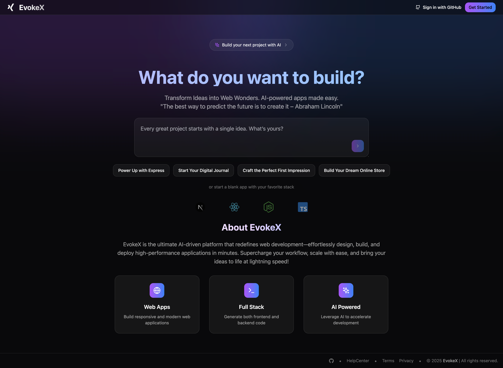
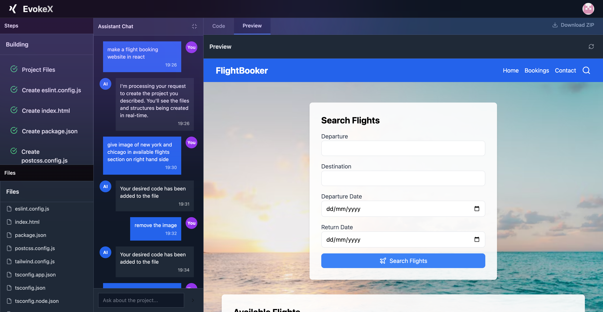

# ⚡ EvokeX – Intelligent Website Builder Using LLMs

**EvokeX** is a web-based intelligent website builder that allows users to generate, edit, and preview websites directly in the browser using natural language prompts. It combines the power of **React**, **Node.js**, and **LLMs** to offer an intuitive and fast interface for modern web development.

**Landing Page**


**Mock Flight Booking Website**


---

## 🌟 Features

- 💬 **LLM-Powered Code Generation** – Generate production-ready code from natural language prompts.
- 🧠 **Context-Aware Suggestions** – Auto-adapts to existing file structure and content.
- 🗂️ **Visual File Explorer** – Live-rendered file structure built in real time.
- ✍️ **Integrated Monaco Editor** – Fully-featured browser-based code editor.
- ⚙️ **In-Browser WebContainer** – No local environment setup needed; live execution in-browser.
- 👁️ **Real-Time Preview** – Reflects changes as you code.
- ⬇️ **One-Click ZIP Download** – Instantly download your full project code as a ZIP file.
- 🔐 **GitHub Authentication** – Seamless sign-up and login with GitHub OAuth.
- 🔄 **Simple Architecture** – Built without complex state libraries (Recoil planned for future use).

---

## 🧑‍💻 Tech Stack

- **Frontend**: React.js , Tailwind CSS, Framer Motion
- **Backend**: Node.js, Express.js
- **Editor**: Monaco Editor
- **Runtime**: WebContainer
- **Auth**: GitHub OAuth

---

## 🚀 How It Works

1. **Prompt the LLM**: Type a request like *“Create a React login page”*.
2. **Code is Generated**: LLM returns code, which is parsed and saved into a virtual file system.
3. **Preview is Compiled**: Code is run in a secure WebContainer and output is rendered live.
4. **Edit & Iterate**: Use Monaco editor to tweak the code manually or with additional prompts.

---

## 🧪 Future Improvements

- ✅ One-click deployment to Vercel or Netlify
- ✅ LLM fine-tuning for framework-specific support
- ✅ Team collaboration features
- ✅ Component-level preview and export
- ✅ Drag-and-drop layout builder

---

### 🛠️ Run Locally

1. Clone the repository:

```bash
git clone https://github.com/22kartikeya/EvokeX.git
```

2. Navigate to the project directory:

```bash
cd EvokeX
```

3. Navigate to the backend directory:

```bash
cd be
```

4. Install Dependencies:

- If using npm:

```bash
npm install
```

- If using yarn:

```bash
yarn install
```

5. Set Up Environment Variables

- Change .env.example to .env file in the be root directory and add your variables:

# === Third-party API Keys ===
MISTRAL_API_KEY=your_mistral_api_key_here
GEMINI_API_KEY=your_gemini_api_key_here

# === MongoDB Connection ===
MONGO_URI=your_mongodb_connection_string_here

# === App Configuration ===
PORT=

# === GitHub OAuth ===
GITHUB_CLIENT_ID=your_github_client_id_here
GITHUB_CLIENT_SECRET=your_github_client_secret_here

# === Session Management ===
SESSION_SECRET=your_secure_session_secret_here

# === URLs ===
FRONTEND_URL=
BACKEND_URL=

6. Navigate to the frontend directory:

```bash
cd ../fe
```

8. Install the dependencies:

- If using npm:

```bash
npm install
```

- If using yarn:

```bash
yarn install
```

9. Run the frontend:

```bash
npm run dev
```

10. Navigate to the backend directory:

```bash
cd ../be
```

11. Run the backend:

```bash
npm run dev
```

12. Open your browser and go to `http://localhost:5173/` to view the app.

---

## 🙌 Credits

Made with ❤️ by Kartikeya Gupta & Priyal Goenka  
🔗 [Kartikeya's LinkedIn](https://www.linkedin.com/in/kartikeya-gupta-81a421251)
🔗 [Priyal's LinkedIn](https://www.linkedin.com/in/priyal-goenka-9b337a282)

---

## 🤝 Contributing

We welcome contributions! Feel free to fork the repo, submit issues, or make pull requests to enhance functionality.

---

## 📄 License

This project is licensed under the [MIT License](./LICENSE).

MIT License © 2025 Kartikeya Gupta  
Permission is hereby granted, free of charge, to any person obtaining a copy  
of this software and associated documentation files (the "Software"), to deal  
in the Software without restriction, including without limitation the rights  
to use, copy, modify, merge, publish, distribute, sublicense, and/or sell  
copies of the Software, and to permit persons to whom the Software is  
furnished to do so, subject to the following conditions:

> The above copyright notice and this permission notice shall  
> be included in all copies or substantial portions of the Software.

**THE SOFTWARE IS PROVIDED "AS IS", WITHOUT WARRANTY OF ANY KIND**, EXPRESS OR  
IMPLIED, INCLUDING BUT NOT LIMITED TO THE WARRANTIES OF MERCHANTABILITY,  
FITNESS FOR A PARTICULAR PURPOSE AND NONINFRINGEMENT. IN NO EVENT SHALL THE  
AUTHORS OR COPYRIGHT HOLDERS BE LIABLE FOR ANY CLAIM, DAMAGES OR OTHER  
LIABILITY, WHETHER IN AN ACTION OF CONTRACT, TORT OR OTHERWISE, ARISING FROM,  
OUT OF OR IN CONNECTION WITH THE SOFTWARE OR THE USE OR OTHER DEALINGS IN THE SOFTWARE.
